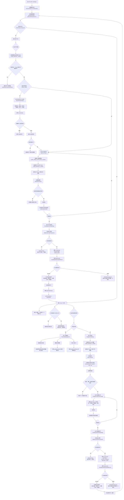

````xml

```mermaid
flowchart TD
  A["进入 Pay Tab / PayPage"] --> B["加载缓存状态<br/>PayCacheService.holderStatus"]
  B --> C["请求最新数据<br/>getHolderStatus + getCardTransactionList"]
  C --> D{"是否已有卡<br/>holderStatus.isOpened"}

  D -->|否| E["展示未开卡页"]
  D -->|是| F["展示 UCard 卡片页"]

  E --> G{"点击开卡按钮"}
  G --> H["检查配置内支持充值 Token<br/>CARD_DEPOSIT_TOKEN"]
  H --> I{"是否有任一 Token 满足开卡最低资产"}
  I -->|否| J["展示资产不足弹窗<br/>InsufficientCardAssetsSheet"]
  I -->|是| K{"当前状态是否 OPEN_CARD"}

  K -->|否| L["进入实名/持卡人认证页<br/>PayVerificationPage"]
  K -->|是| M["进入开卡支付页<br/>ApplyCardPage"]

  L --> N["填写姓名、邮箱、手机号、验证码、生日、卡币种"]
  N --> O["调用 createHolder"]
  O --> P{"创建持卡人是否成功"}
  P -->|失败| Q["展示认证失败页"]
  P -->|成功| R["展示认证成功页"]
  R --> S{"是否免费开卡"}
  S -->|是| T["返回首页 / 等待状态刷新"]
  S -->|否| M

  M --> U["加载开卡费用配置<br/>CARD_OPEN_ACTIVE_FEE_CONFIG"]
  U --> V["加载默认开卡支付 Token<br/>CARD_DEFAULT_TOKEN"]
  V --> W["选择支付 Token / 展示支付金额"]
  W --> X["估算网络费<br/>NetworkFeeCubit"]
  X --> Y{"余额与网络费是否足够"}
  Y -->|否| Z["禁用确认或提示充值"]
  Y -->|是| AA["点击确认"]
  AA --> AB["应用密码/生物识别授权<br/>authorizationVerify"]
  AB --> AC{"授权成功"}
  AC -->|否| M
  AC -->|是| AD["进入开卡提交页<br/>CardApplySubmittingPage"]

  AD --> AE["签名链上转账<br/>WalletCubit.signTransaction"]
  AE --> AF{"签名是否成功"}
  AF -->|否| AG["failedOnChain<br/>展示开卡失败，可重试"]
  AF -->|是| AH["调用 createOrder<br/>orderType 默认 OPEN_CARD"]
  AH --> AI["等待 WebSocket<br/>CardApplyStatusUpdateEvent"]
  AI --> AJ{"后台通知状态"}
  AJ -->|success| AK["开卡成功完成页<br/>成功动画 + 查看卡片 + 查看订单 + 浏览器"]
  AJ -->|failed| AL["failedOnBackground<br/>展示无法确认支付结果，可重试"]
  AK --> AM["点击查看卡片"]
  AM --> AN["刷新 getHolderStatus"]
  AN --> AO["emitCardStatus + popToRoot"]
  AO --> F

  F --> AP["展示卡余额、卡号尾号、卡管理入口"]
  F --> AQ{"卡状态是否 COMPLETE"}
  AQ -->|是| AR["展示最近交易记录"]
  AQ -->|否| AS["展示待激活状态<br/>按钮文案：充值激活"]

  F --> AT{"点击充值/激活按钮"}
  AT --> AU{"卡是否冻结"}
  AU -->|是| AV["进入卡管理页<br/>PayCardManagement"]
  AU -->|否| AW["进入充值页<br/>ChargeUCardPage"]

  AW --> AX["加载充值 Token 配置<br/>CARD_DEPOSIT_TOKEN"]
  AX --> AY["选择支付 Token / 输入代币数量"]
  AY --> AZ["请求报价<br/>getCoinQuote"]
  AZ --> BA["计算预计到账法币金额<br/>receiveAmount = amount * rate * fee"]
  BA --> BB["估算网络费"]
  BB --> BC{"金额、余额、最低充值是否满足"}
  BC -->|否| BD["禁用下一步或提示充值"]
  BC -->|是| BE["进入充值确认页<br/>ChargeUCardConfirmPage"]

  BE --> BF["展示支付 Token、预计到账、手续费、网络费、发送地址"]
  BF --> BG["点击确认"]
  BG --> BH["应用密码/生物识别授权"]
  BH --> BI{"授权成功"}
  BI -->|否| BE
  BI -->|是| BJ["进入充值提交页<br/>CardDepositSubmittingPage"]

  BJ --> BK["签名链上转账<br/>WalletCubit.signTransaction"]
  BK --> BL{"签名是否成功"}
  BL -->|否| BM["failedOnChain<br/>展示失败，可重试"]
  BL -->|是| BN["调用 createOrder<br/>orderType = ACTIVE_CARD 或 DEPOSIT_CARD"]
  BN --> BO["等待 WebSocket<br/>CardDepositStatusUpdateEvent"]
  BO --> BP{"后台通知状态"}
  BP -->|success| BQ["充值成功完成页<br/>成功动画 + 查看卡片 + 查看订单 + 浏览器"]
  BP -->|failed| BR["failedOnBackground<br/>展示无法确认支付结果，可重试"]
  BQ --> BS["点击查看卡片 / 返回"]
  BS --> C

  AV --> BT["查看完整卡信息"]
  AV --> BU["调整交易限额"]
  AV --> BV["冻结 / 解冻卡"]
  BT --> BW["应用密码/生物识别后查看敏感卡信息"]
  BU --> BX["调用 updateCardLimit 后刷新状态"]
  BV --> BY["调用 updateCardStatus 后刷新状态"]
```
````

